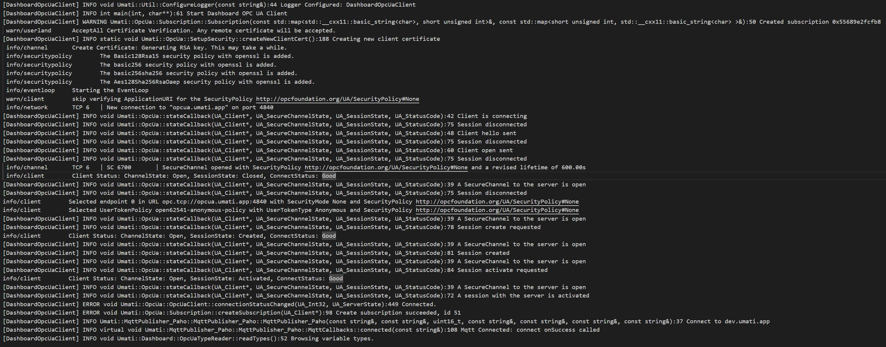

# Executing Standalone Dashboard-OPCUA-Client

1. Obtain the OPC UA Client Binaries:
There are two options for obtaining the binaries:
    1. Download the stable version from [Releases](https://github.com/umati/Dashboard-OPCUA-Client/releases)

        1. Select `latest` release.
        2. Download artefact for your operating system.
           - use windows-2022 for most versions of windows 2010 and window 2011 (only older version need windows-2019 (see [#477](https://github.com/umati/Dashboard-OPCUA-Client/issues/477) for details)
        3. If older than 4 weeks use alternative option.

    2. Download the development version from the latest [CI](https://github.com/umati/Dashboard-OPCUA-Client/actions/workflows/build.yml) run

        1. Select newest workflow run.
        2. Download artifact for your operating system.

2. Unzip Folder
    1. Linux: Install `.deb` package with `sudo dpkg -i dashboardopcuaclient_*_*.deb`
3. Create configuration for Client on Windows:
    1. Within folder `bin` create a file called `configuration.json`
4. Create configuration for Client on Linux:
    1. Create a file `configuration.json` in your home directory
5. Adapt configuration
    1. Open `configuration.json` (use any text editor) and insert content from here
        1. [configuration.json.example](../configuration.json.example)
        2. Change OPC UA and MQTT endpoint information according to [Configuration](./Configuration.md)

6. Start on Windows `DashboardOpcUaClient.exe`.

7. Start on Linux `DashboardOpcUaClient configuration.json` from your home directory

    1. The start-up phase can last for up to 10 minutes, depending of the size of the server. When the client is connected to the MQTT broker a `1` is transmitted to the MQTT Broker on the topic `umati/v2/<CompanyName>/<ClientName>/clientOnline`. The output of the console should look like this:

    2. After the start up a JSON containing all machine values is published on the MQTT Broker at topic `umati/v2/<CompanyName>/<ClientName>/<SpecificationType>/<EscapedMachineNodeId>` (e.g. `umati/v2/ISW/ClientSampleServer/MachineToolType/nsu=http:_2F_2Fexample.com_2FBasicMachineTool_2F;i=66382`)

<!-- markdownlint-disable MD033 -->

Troubleshooting

## Common errors

1. Missing DLLs
    In case DLLs are missing, those are most likely from the Visual C++ Redistributable package. Those can be downloaded [here](https://learn.microsoft.com/en-us/cpp/windows/latest-supported-vc-redist?view=msvc-170).

