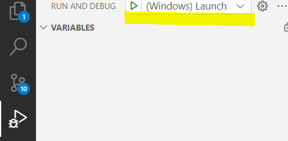

# How to build and debug using vscode
## Prerequisites
* Visual Studio Code
* [Build tools for Visual Studio](https://visualstudio.microsoft.com/de/downloads/#build-tools-for-visual-studio-2022)
* Visual Studio Code *CMake Tools* extension
* Visual Studio Code *C/C++ Extension Pack* extension

## Download and Build
```ps
git clone https://github.com/umati/Dashboard-OPCUA-Client
git submodule update --init --recursive
# Get the .vscode folder
cp -R doc/.vscode .
```

There are two cmake-based build steps using two different `CMakeLists.txt`:
1. `.github/CMakeLists.txt` Builds the dependencies (git submodules) and the Dashboard-OPCUA-Client. Only required once after pulling the repository or after an update of the dependencies.
2. `./CMakeLists.txt` builds only the Dashboard-OPCUA-Client not the dependencies. This file is used for building and testing.

For Step 1 run the following commands in powershell:

```ps
# Build folder for dependencies (submodules)
mkdir _deps
# Install folder for dependencies
mkdir _install

cd _deps
# Replace <...> with your path to the repository
cmake -DCMAKE_INSTALL_PREFIX:PATH="C:\<...>\Dashboard-OPCUA-Client\_install" ..\.github
cmake --build .
```
For Step 2, i.e., building only the Dashboard-OPCUA-Client:
* Hit `ctrl+shift+p` and enter `> CMake: Select a Kit` command. Then select *Visual Studio Build Tools 2022 Release - x86_amd64*
* Hit `ctrl+shift+p` and enter `> CMake: Configure` to configure
* Hit `ctrl+shift+p` and enter `> CMake: Build Target` the select `DashboardOpcUaClient EXECUTABLE` to build.

Alternativly you can use the buttons at the bottom of the IDE:


Alternative for Step 2 (using commandline):
```ps
mkdir build
cd build
# Replace <...> with your path to the repository
cmake --no-warn-unused-cli -DCMAKE_INSTALL_PREFIX:STRING="C:/<...>/Dashboard-OPCUA-Client/_install" -DCMAKE_EXPORT_COMPILE_COMMANDS:BOOL=TRUE -G "Visual Studio 17 2022" -T host=x86 -A x64 ..
cmake --build . -t DashboardOpcUaClient
```

## Running using vscode
Note: You will need a running OPC UA server (e.g. [https://github.com/umati/Sample-Server](https://github.com/umati/Sample-Server)) and a mqtt broker.
You can start a mqtt-broker using docker:
```ps
.\.vscode\run_mosq.ps1
```

Edit the sample configuration.json file in `.vscode/configuration.json`

Run by hitting the green arrow.




Alternatively run by using powershell:
```ps
# In root directory of repository
.\build\Debug\Dashboard.exe .\vscode\configuration.json
```